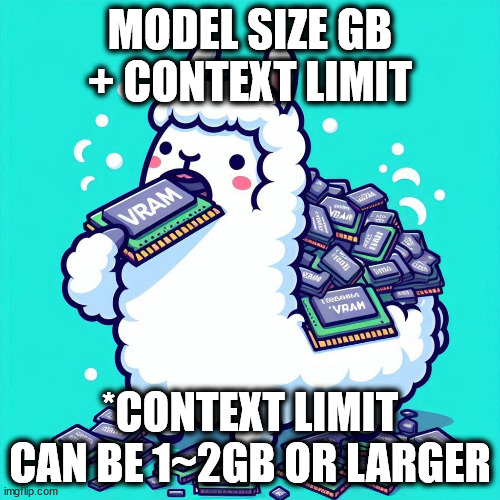
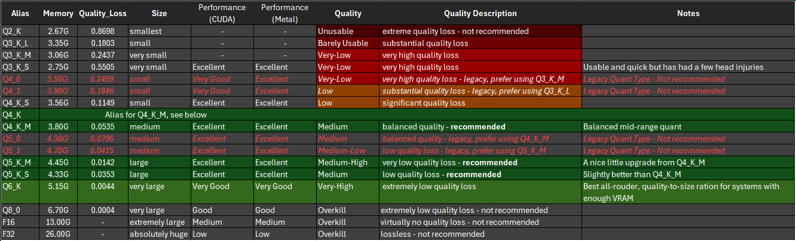

# Whispers_Ollama_FAQ

This is a small bit of info to help address the most common questions I see in the Ollama discord.

Ollama Questions
* [1) I have a question](#1-i-have-a-question)
* [2) It fails when I pull / run a model](#2-it-fails-when-i-pull--run-a-model)
  + [2.1) Pulling a model?](#21-pulling-a-model)
  + [2.2) Running a model?](#22-running-a-model)
* [3) Can I run X model?](#3-can-i-run-x-model)
  + [3.1) How do I know what size model I can run?](#31-how-do-i-know-what-size-model-i-can-run)
  + [3.2) I don't have a GPU...](#32-i-dont-have-a-gpu)
  + [3.3) I have more than one GPU...](#33-i-have-more-than-one-gpu)
  + [3.4) But wait, I have a mac, and it has Unified Memory!](#34-but-wait-i-have-a-mac-and-it-has-unified-memory)
* [4) Ollama is not using all my resources OR GPU is not being used but my CPU is at 100%](#4-ollama-is-not-using-all-my-resources-or-gpu-is-not-being-used-but-my-cpu-is-at-100)
* [5) I am using OpenWeb UI and ...](#5-i-am-using-openweb-ui-and)
* [6) Ollama Env Variables?](#6-ollama-env-variables)
* [7) Ok, I have a question, and none of the previous resources answer it](#7-ok-i-have-a-question-and-none-of-the-previous-resources-answer-it)

Further Reading
* [1) What are Parameters?](#1-what-are-parameters)
* [2) What is Quantization?](#2-what-is-quantization)
  + [2.1) How does Quantization impact LLMs?](#21-how-does-quantization-impact-llms)
  + [2.2) How can I Quantizize a model to fit my GPU/System?](#22-how-can-i-quantizize-a-model-to-fit-my-gpusystem)
* [3) What is Abliteration?](#3-what-is-abliteration)
* [4) What is Tool Use?](#4-what-is-tool-use)
* [5) What is Prompt Engineering?](#5-what-is-prompt-engineering)
* [6) What is Embedding?](#5-what-is-embedding)
* [7) What is Retrieval Augmented Generation (RAG)?](#7-what-is-retrieval-augmented-generation-rag)
  + [7.1) So what do we do then?](#71-so-what-do-we-do-then)
  + [7.2) Check out these resources!](#72-check-out-these-resources)
* [8) What is Fine-tuning?](#8-what-is-fine-tuning)
  + [8.1) What is Fine-tuning good for?](#81-what-is-fine-tuning-good-for)
  + [8.2) Fine-tuning considerations](#82-fine-tuning-considerations)
* [9) Lastly! I am just a guy on the internet.](#9-lastly-i-am-just-a-guy-on-the-internet)


# Ollama Questions 

## 1) I have a question

Did you read the FAQ yet? [https://github.com/ollama/ollama/blob/main/docs/faq.md](https://github.com/ollama/ollama/blob/main/docs/faq.md)

### 1.1) Yes, and my question isn't answered by the FAQ

Did you look at the other documentation, such as GPU, API, Docker, Linux, Windows, Troubleshooting, etc?

## 2) It fails when I pull / run a model

### 2.1) Pulling a model?

Try changing your DNS to 1.1.1.1 or 8.8.8.8

The most common issue is caused by some kind of DNS caching.

### 2.2) Running a model?

Make sure you have the most up to date version of Ollama.

Make sure you installed it using the methods shown on the Ollama website.

Still having an issue? Go to the Ollama discord and open a ticket in the #Help channel. See #9 below.

## 3) Can I run X model?

In order to run a model on Ollama it needs to load the model and some space for message context into memory.

Ideally this will be VRAM on your GPU. If the model + context is more than the available VRAM on your GPU it will use your systems RAM.

When you are using RAM in any capacity, it will slow down the models response due to bottlenecks at the speed of the RAM, the CPU, and the Bus.

### 3.1) How do I know what size model I can run?

Look up your GPU, is it supported?  [https://github.com/ollama/ollama/blob/main/docs/gpu.md](https://github.com/ollama/ollama/blob/main/docs/gpu.md)

If yes, how much VRAM does it have?

You will want the size of the model in GBs + 1~2 GBs to be less than your total VRAM.

> ### *for example: `llama3.2:3b` is 2GB in size, this means you need 2GB of VRAM available and 1 to 2 more GBs of VRAM to handle message context, so you should have at least 4GB of VRAM to use it quickly.*
>
> Keep in mind that other things might be using your VRAM as well.



*You CAN use it with RAM, but it will be slower.*

### 3.2) I don't have a GPU...
That's fine, Ollama automatically will use your RAM. Just in case you missed it all the times its written here, RAM IS SLOW. 

# 3.3) I have more than one GPU...
Ollama will use more than one GPU, BUT:
- They need to be supported
- They need to be the same manufacturer (both Nvidia or Both AMD, etc)
*Caveat: You can run multiple instances of Ollama, one on an Nvidia card and one on an AMD for example*

## 3.3) But wait, I have a mac, and it has Unified Memory!

Ok, so basically its the same rules, but don't get hung up on RAM vs VRAM. You still need the memory to run the model.

From what I understand, Unified Memory is slower than VRAM, but faster than RAM. I dunno, I dont use Macs.

## 4) Ollama is not using all my resources OR GPU is not being used but my CPU is at 100%

So, if you read #3 you know that you really want Ollama to use your GPU and to do that the model needs to fit into the available VRAM.

If you are experiencing this problem, you probably have a model that doesnt fit OR you dont have a supported GPU.

So why do you see all the CPU usage and nothing on GPU.

The answer is simple. The GPU is waiting for the CPU to catch up. This is because the CPU, RAM, and Bus are slower. One, if not all three, of those will be the constraint.

There is no magic work around for this, except you may find you get a bit better performance if you choose an LLM that is optimzied for CPU, like the Granite3 models.

## 5) I am using OpenWeb UI and ...

Is it an Ollama question? does the issue happen when using Ollama by itself? If yes, please ask it in the [Ollama discord](https://discord.gg/q7myykKWYR) general chat and/or open a ticket in Help. (But check out the #9 before hand)

Otherwise, go ask in the OpenWeb UI discord. They will know how to answer OpenWeb UI questions.

## 6) Ollama Env Variables?

From Windows: (Linux has a few more)
```
Environment Variables:
      OLLAMA_DEBUG               Show additional debug information (e.g. OLLAMA_DEBUG=1)
      OLLAMA_HOST                IP Address for the ollama server (default 127.0.0.1:11434)
      OLLAMA_KEEP_ALIVE          The duration that models stay loaded in memory (default "5m")
      OLLAMA_MAX_LOADED_MODELS   Maximum number of loaded models per GPU
      OLLAMA_MAX_QUEUE           Maximum number of queued requests
      OLLAMA_MODELS              The path to the models directory
      OLLAMA_NUM_PARALLEL        Maximum number of parallel requests
      OLLAMA_NOPRUNE             Do not prune model blobs on startup
      OLLAMA_ORIGINS             A comma separated list of allowed origins
      OLLAMA_SCHED_SPREAD        Always schedule model across all GPUs                           
      OLLAMA_FLASH_ATTENTION     Enabled flash attention
      OLLAMA_KV_CACHE_TYPE       Quantization type for the K/V cache (default: f16)
      OLLAMA_LLM_LIBRARY         Set LLM library to bypass autodetection
      OLLAMA_GPU_OVERHEAD        Reserve a portion of VRAM per GPU (bytes)
      OLLAMA_LOAD_TIMEOUT        How long to allow model loads to stall before giving up (default "5m")
```

## 7) Ok, I have a question, and none of the previous resources answer it

Great, ok, you are more than welcome to ask it in the Ollama discord general chat or open a ticket in the Help channel. But first, ask yourself a few questions:

1) When I ask the question, am I giving them all the information they need to answer it?
2) How complicated is my question, how much of it depends on my own computer/system?
3) Am I asking someone for help after I have done my own research?
4) When I post my question, do I realize that I might not get an answer right away?

If you are not sure, maybe take a look at how stackoverflow suggests you should ask.

[https://stackoverflow.com/help/how-to-ask](https://stackoverflow.com/help/how-to-ask)


# Further Reading


## 1) What are Parameters?

LLM parameters are numerical values that control how a Large Language Model (LLM) processes and generates text.

They are learned during training and adjusted to help the model understand language.

More is technically better, but in a lot of cases the extra accuracy is not really usable.

## 2) What is Quantization?

LLM quantization is a technique that reduces the precision of weights and activations in large language models (LLMs).

This process makes LLMs more efficient and accessible by reducing their size.

This also makes them less accurate. Generally Q4 and up are fine. Anything smaller can be a little crazy. **Mileage May Vary.**

### 2.1) How does Quantization impact LLMs?

See below on how Quantization affects LLMs, and what you might want to consider.



file: [quantization_type.xlsx](quantization_type.xlsx)

### 2.2) How can I Quantizize a model to fit my GPU/System?

I am just starting to mess around with this myself, but so far I know of two good methods.

  1) You can use Ollama to do the quantization, info is here: [https://github.com/ollama/ollama/blob/main/docs/modelfile.md](https://github.com/ollama/ollama/blob/main/docs/modelfile.md)
  2) You can use a service on Huggingface for free, here: [https://huggingface.co/spaces/ggml-org/gguf-my-repo](https://huggingface.co/spaces/ggml-org/gguf-my-repo)
  
> Note, you will need to sign up for a free account for that to work. Also, you can import models from Huggingface directly through Ollama using the `ollama pull hf.co/<user>/<model>`, see this: [https://huggingface.co/docs/hub/en/ollama](https://huggingface.co/docs/hub/en/ollama)


## 3) What is Abliteration?

Modern LLMs are fine-tuned for safety and instruction-following, meaning they are trained to refuse harmful requests.

In their [blog post](https://www.lesswrong.com/posts/jGuXSZgv6qfdhMCuJ/refusal-in-llms-is-mediated-by-a-single-direction), Arditi et al. has shown that this refusal behavior is mediated by a specific direction in the model's residual stream.

If we prevent the model from representing this direction, it  **loses its ability to refuse requests** .

Conversely, adding this direction artificially can cause the model to refuse even harmless requests.

source: [https://huggingface.co/blog/mlabonne/abliteration](https://huggingface.co/blog/mlabonne/abliteration)

## 4) What is Tool Use?

Tool Use, in which an LLM is given functions it can request to call for gathering information, taking action, or manipulating data, is a key design pattern of AI agentic workflows. You may be familiar with LLM-based systems that can perform a web search or execute code.

source: [https://www.deeplearning.ai/the-batch/agentic-design-patterns-part-3-tool-use/](https://www.deeplearning.ai/the-batch/agentic-design-patterns-part-3-tool-use/)

TLDR; if you are writing code and you want an LLM to use your functions, that is tool use. 

## 5) What is Prompt Engineering?

Prompt engineering is the art and science of designing and optimizing prompts to guide AI models, particularly LLMs, towards generating the desired responses. By carefully crafting prompts, you provide the model with context, instructions, and examples that help it understand your intent and respond in a meaningful way. Think of it as providing a roadmap for the AI, steering it towards the specific output you have in mind.

source [https://cloud.google.com/discover/what-is-prompt-engineering](https://cloud.google.com/discover/what-is-prompt-engineering)

You can do a **LOT** with Prompt Engineering. It can be as simple as `You are a helpful assistant` to something like this:
```
req_gather = """
<IDENTITY>You are part of a Project Management Team. Your role is understand the customers request and define the requirements.</IDENTITY>
<RULES>
	1) Listen to the customer to find out what they are asking for. 
	2) Define the overall objective from the customer request.
	3) Identify the desired endstate.
	4) Identify the requirements.
	5) When responding to the customer, always provide the Purpose, Desired Endstate, and Requirements in addition to your response. 
	6) Ask questions to help the customer flesh out their idea.
</RULES>
<GUIDELINES>
	1) Make suggestions in order to make sure you get enough information.
	2) If you make a mistake, apologize, and reevaluate what the customer is asking.
</GUIDELINES>
<CONVERSATION_HISTORY>
{chat_history}
</CONVERSATION_HISTORY>
<CUSTOMER_REQUEST>
{query}
</CUSTOMER_REQUEST>
"""
```

The above is currently how I do my system prompts. I find that using the XML like format really helps the LLMs stick to the info I provide. 

In the example above I am using a python string, and before I send it to the LLM i replace `{chat_history}` and `{query}` with the actual values, using the `.format()` function in python. 

Further reading: [https://github.com/varungodbole/prompt-tuning-playbook](https://github.com/varungodbole/prompt-tuning-playbook)

## 6) What is Embedding?

In the context of Large Language Models (LLMs), an "embedding" is a numerical representation of a word, phrase, or piece of text that captures its semantic meaning , allowing the LLM to understand the context and relationships between different pieces of information by placing them as vectors in a high-dimensional space where similar concepts are positioned close together; essentially, it's a way to translate language into a format that computers can easily process and reason with

check out this article: [https://medium.com/mongodb/how-to-choose-the-best-embedding-model-for-your-llm-application-2f65fcdfa58d](https://medium.com/mongodb/how-to-choose-the-best-embedding-model-for-your-llm-application-2f65fcdfa58d)

## 7) What is Retrieval Augmented Generation (RAG)

Retrieval Augmented Generation (RAG) is  an AI technique that enhances the capabilities of a large language model (LLM) by allowing it to access and reference external information sources, like a knowledge base or database, before generating a response, essentially providing more context and accuracy to the generated output by retrieving relevant data specific to a given query or situation.

The simplest form of RAG is taking the content of a document and simply shoving it into the context windows of an LLM. The fact that LLMs can have pretty large context windows these days means this is somewhat feasible. However, its not a great solution.

First, you are giving it a lot of data, and to fit that you need a large context window, so that's going to eat a lot of your hardware's available memory. This can cause the LLMs to slow down (see #3), or you may have more data than what can fit in the context window.

Second, its going to take longer because there is a lot of data that's not relevant to your query.

Third, many LLMs will find the first close enough match and respond. What if the comprehensive answer can only be provided when all of the information has been reviewed.

### 7.1) So what do we do then?

Check out the document links below, but the TLDR; is that you will use an LLM like a retriever to find the most relevant / top k results, and provide those to the LLM to answer. (Honestly at a minimum I would suggest this). Then you are more likely to get a comprehensive answer, and its much quicker, and a more efficient use of your resources.

As you dig into the links below you will see that it can get pretty advanced, and you may find that some solutions are not necessary for your use case. Thats fine, better to know what you can do and not need it, than the alternative.

### 7.2) Check out these resources!

- Intro to **RAG**: [https://blog.gopenai.com/**rag**-in-action-enhancing-ai-with-real-time-data-retrieval-9fc216710013](https://blog.gopenai.com/rag-in-action-enhancing-ai-with-real-time-data-retrieval-9fc216710013)
- Bit more advanced, i wrote this one: [https://medium.com/@sergio1101102/mastering-retrieval-augmented-generation-**rag**-a-practical-guide-for-new-developers-624be24ca516](https://medium.com/@sergio1101102/mastering-retrieval-augmented-generation-rag-a-practical-guide-for-new-developers-624be24ca516 "https://medium.com/@sergio1101102/mastering-retrieval-augmented-generation-rag-a-practical-guide-for-new-developers-624be24ca516")
- A simple **RAG** tool that uses ollama, you can copy the code for what you need: [https://github.com/maglore9900/chat_with_docs](https://github.com/maglore9900/chat_with_docs "https://github.com/maglore9900/chat_with_docs")
- Bit even more advanced, where I wrote about my own experience with a specific use case: [https://medium.com/@sergio1101102/mastering-**rag**-a-practical-guide-for-new-developers-part-2-786858742e91](https://medium.com/@sergio1101102/mastering-rag-a-practical-guide-for-new-developers-part-2-786858742e91 "https://medium.com/@sergio1101102/mastering-rag-a-practical-guide-for-new-developers-part-2-786858742e91")
- How to evaluate your RAG solution:
[https://cloud.google.com/blog/products/ai-machine-learning/optimizing-rag-retrieval/](https://cloud.google.com/blog/products/ai-machine-learning/optimizing-rag-retrieval/)
- How to Build a Local RAG Using DeepSeek-R1, LangChain, and Ollama:
[https://blog.gopenai.com/how-to-build-a-privacy-first-rag-using-deepseek-r1-langchain-and-ollama-c5133a8514dd](https://blog.gopenai.com/how-to-build-a-privacy-first-rag-using-deepseek-r1-langchain-and-ollama-c5133a8514dd)
## 8) What is Fine-tuning?

Fine-tuning in machine learning is the process of adapting a pre-trained model for specific tasks or use cases. It has become a fundamental deep learning technique, particularly in the training process of foundation models used for generative AI.

Fine-tuning could be considered a subset of the broader technique of transfer learning: the practice of leveraging knowledge an existing model has already learned as the starting point for learning new tasks.

source: https://www.ibm.com/think/topics/fine-tuning

### 8.1) What is Fine-tuning good for?

- Customizing style: Models can be fine-tuned to reflect a brand’s desired tone, from implementing complex behavioral patterns and idiosyncratic illustration styles to simple modifications like beginning each exchange with a polite salutation.

- Specialization: The general linguistic abilities of LLMs can be honed for specific tasks. For example, Meta’s Llama 2 models were released as base foundation models, chatbot-tuned variants (Llama-2-chat) and code-tuned variants (Code Llama). 

- Adding domain-specific knowledge: While LLMs are pre-trained on a massive corpus of data, they are not omniscient. Using additional training samples to supplement the base model’s knowledge is particularly relevant in legal, financial or medical settings, which typically entail use of specialized, esoteric vocabulary that may not have been sufficiently represented in pre-training.

- Few-shot learning: Models that already have strong generalized knowledge can often be fine-tuned for more specific classification texts using comparatively few demonstrative examples. 

- Addressing edge cases: You may want your model to handle certain situations that are unlikely to have been covered in pre-training in a specific way. Fine-tuning a model on labeled examples of such situations is an effective way to ensure they are dealt with appropriately.

- Incorporating proprietary data: Your company may have its own proprietary data pipeline, highly relevant to your specific use case. Fine-tuning allows this knowledge to be incorporated into the model without having to train it from scratch.

source: https://www.ibm.com/think/topics/fine-tuning

### 8.2) Fine-tuning considerations

Before fine-tuning or training an LLM, ask yourself: is it really necessary?

If you have a large dataset organized in a question-answer format, fine-tuning can be effective. However, if your data is unstructured, it’s not worth the time or cost to organize it. Also, if your data is dynamic and constantly changing, fine-tuning isn’t the best approach.

In cases where your data is unstructured or frequently updated, consider using Retrieval-Augmented Generation (RAG) instead. RAG retrieves the most relevant chunks of data based on the query and allows the LLM to generate an answer using that context.

source: [https://github.com/ItzCrazyKns](https://github.com/ItzCrazyKns)

My personal opinion, Customizing style can be accomplished with Prompt Engineering, Specialization and Domain-specific Knowledge can be accomplished with RAG, as well as Incorporating proprietary data. 

I think the biggest reason to Fine-tune is to address edge-case issues and/or to meet specific use-cases, OR if you want to give domain specific knowledge to a really small model where RAG isnt feasible. Such as when you deploy small LLMs to edge devices. 

There are limitations on Prompt Engineering and RAG, and you can over come those with Fine-tuning, but by and large those are easier to implement and will cover most use cases. 

### 8.3) I still want to Fine-tune!

Check out [unsloth](https://unsloth.ai), while I haven't used this service, it is generally the most highly recommended method. Alternatively, check out Huggingface, https://huggingface.co/docs/transformers/en/training.

## 9) Lastly! I am just a guy on the internet.

I am not on the Ollama team, I am not a representative of an org. I'm just a guy that likes the community, likes the product, and tries to help people. So if you are offended by anything above, well, I'm sorry for you.

Just keep in mind, these are my opinions. Not a representation of Ollama.